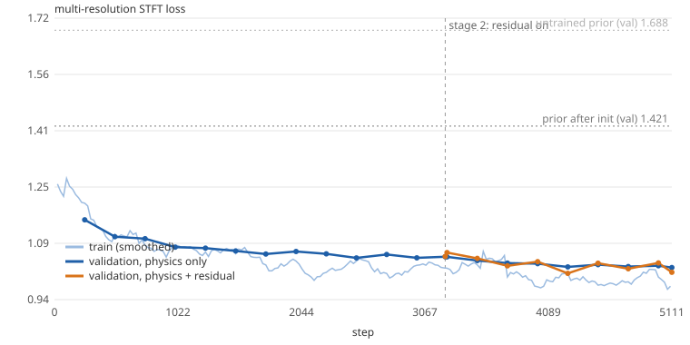
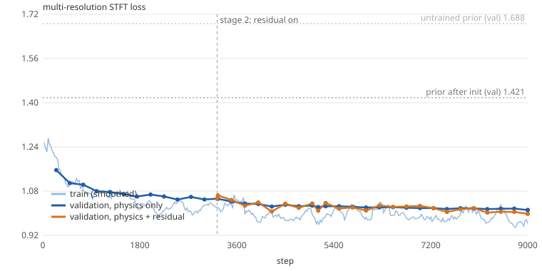

# First trial on MAESTRO: one year (2018), two hours

The plan behind this run is in [`plan_phase0_1.md`](plan_phase0_1.md). This page reports what happened.

> **Corrected after review 4** ([`reviews/review_4_trial_2018.md`](reviews/review_4_trial_2018.md); measurements in
> [`plan_round2.md`](plan_round2.md), section 2). Corrected claims are marked *[corrected]* where they stand. In brief:
> - the headline starts at the initialised prior: the untrained prior was 16 dB too quiet, so its row measures level;
> - the loss's spectral-convergence term set the model's level about 1.8 dB low in every band. That explains the
>   soft-playing deficit better than the pedal decay. *[round 2]* On review 4's 96 test excerpts the 220-minute model
>   shows no soft deficit at all: −1.2 dB on soft excerpts, −2.6 dB on loud ones
>   ([`round2_results.md`](round2_results.md), section 2);
> - the "60–125 Hz drift" came from three validation excerpts; on test excerpts every band is 1–3 dB under;
> - the fitted noise floor matches the recordings' silence; it was the initial floor estimate that was wrong;
> - the residual's gain had no control run, and its noise path was held down by a flawed budget term and, as round 2
>   showed, by the loss itself;
> - the phantom partials are plausible, not established.

**In short.** On MAESTRO 2018 (stereo, RTX 3090): a 2 h run (5,111 steps), a continuation to 220 min (9,000
steps), and two 40-minute follow-up experiments.

| held-out test audio (48 excerpts) | MR-STFT loss | log-mel L1 |
|---|---|---|
| untrained prior (16 dB too quiet: this row measures level, not the prior) | 1.747 | 15.1 dB |
| prior with its recording chain initialised from the recordings (**the honest starting point**) | 1.404 | 6.7 dB |
| fitted physics, 2 h | 1.023 | 4.0 dB |
| fitted physics + learned residual, 220 min | **1.002** | **3.84 dB** |

- **Go.** The physics fits real performance audio and carries almost all of the gain. On one excerpt it beats the recording chain alone, and on held-out audio it takes the mel distance from 6.7 to 4.0 dB.
- **The residual costs nothing and reads as a map** *[corrected]*. It was neutral while the physics was still improving, then gained −0.23 dB log-mel by correcting per-note loudness in context. That gain has no physics-only control of the same length yet, and the physics alone was still improving. Throughout, it reported the model's errors (knock ~1 dB loud, 2.5–4 kHz hot) instead of hiding them. It added no noise, but the budget term forbade noise wherever the physics was silent, so that is not a finding.
- **Phantom partials: plausible, not established** *[corrected]*. The fit raised the middle register's phantom partials 10–14 dB above the prior. A component at exactly 2f_j is in the recordings for j = 3 and 5 in 10–20 % more notes than chance. But its level does not grow like a phantom's (a_j²), and it decays no faster than partial 2j (`scripts/measure_phantoms.py`).
- **Frequencies are not identifiable from this loss.** Started from a bass inharmonicity 2.4× too high, the fit stayed there, and the validation loss did not notice. Measured per-year frequencies (isolated-note mining) are necessary.
- **Open errors, named:**
  - the model is 1–3 dB under the recordings in every band from 60 Hz to 5 kHz, and soft, pedalled playing is ~2 dB quieter still *[corrected]*. The spectral-convergence term puts its optimum ~1.8 dB low in every band. The "60–125 Hz drift" of section 5 came from three validation excerpts;
  - the attack is the worst resolution: its level relative to the note is right, but it is ~3 dB too bright above 4 kHz.
- Next steps are in section 12.

## 1. Setup

- **Data**: MAESTRO v3, year 2018 only: 70 training pieces (22.9 h), 13 validation (3.1 h) and 10 test
  (1.4 h). Stereo FLAC at 24 kHz, read straight from the zip (`scripts/prepare_maestro.py --years 2018`,
  under a minute).
- **Examples**: random windows with a 1 s warm-up and a 2 s loss window, 12 s of lookback (notes and
  control curves), batch 8.
- **Model**: everything in [`plan_phase0_1.md`](plan_phase0_1.md) section 1. The sympathetic bank is off,
  and there is no GAN.
- **Loss**: multi-resolution STFT (4096…128) on both channels, with the loss floor at −80 dBFS.
- **Schedule**: 120 min wall clock including validation. Stage 1 (physics + recording chain) for the first
  60 %, then stage 2 (+ `partial_gain`, colouration, residual; physics lr ×0.3). Adam at 1e-3 with
  per-unit multipliers.
- **Hardware**: RTX 3090, about 1.3 s per step of 8 examples.

## 2. Before training: what the recordings say

All of these are measured, not learned (`pianonn/fit_init.py`, `scripts/mine_notes.py`):

| quantity | 2018 estimate | how |
|---|---|---|
| inharmonicity B, bass (MIDI 21–47) | 5.5–5.8e-5, **0.47× the prior** | 421 isolated notes, partial tracking (232 reliable B fits) |
| inharmonicity B, MIDI 48–83 | 0.83×, 0.98×, 1.04× the prior | same |
| stretch | within −1.2…+3.5 cents of the prior; A4 +1.6 cents re 440 Hz | same, per-register medians |
| latency, model re recording | −0.6 ms | onset-strength cross-correlation, 32 training excerpts |
| tuning after the mined stretch | +1.4 cents (left to training) | log-frequency spectral cross-correlation |
| mic gain | +16.5 / +15.8 dB (L/R) | level of renders vs recordings, 100 Hz–5 kHz |
| long-term spectrum re the prior's body | −8 dB at 63 Hz, −5 to −9 dB at 0.5–1 kHz, **+8 to +10 dB at 4–8 kHz** | third-octave ratio, folded into the body FIRs |
| noise floor | −40 dB (40 Hz band) falling to −86 dB (10 kHz band), white-equivalent dBFS | 2nd percentile of 0.2 s band energies |

The recordings are much brighter than the prior's body (its high-frequency droop came from a close-miked
upright measurement, Wogram), and the 2018 piano's bass strings are about half as inharmonic as the Iowa
Steinway B's. The B error is out of reach of gradient descent (a 2× error puts the 30th partial of A1
about 50 Hz away), which the ablation in section 10 confirms.

Validation loss (32 fixed excerpts, physics only):

| state | MR-STFT loss |
|---|---|
| untrained prior | 1.688 |
| after the mined B/stretch and the data init | 1.421 |

## 3. Go/no-go: overfitting one excerpt

`scripts/overfit_excerpt.py` fits one 10 s validation excerpt (90 notes including lookback) for 200 steps
from the same initialised prior, with three parameter sets (loss at steps 0 / 50 / 100 / 150 / 200):

| rung | trainable | 0 | 50 | 100 | 150 | 200 |
|---|---|---|---|---|---|---|
| A: recording chain (bodies, hall, gains, floor) + per-condition scalars | 233k | 1.286 | 1.013 | 0.947 | 0.911 | 0.886 |
| B: A + all the physics | 242k | 1.286 | 0.976 | 0.892 | 0.845 | 0.814 |
| C: B + residual | 426k | 1.279 | 0.926 | 0.833 | 0.786 | 0.757 |

The physics explains real audio beyond what the recording chain can (B < A at every point, with only 9k
more parameters), and the residual adds on top. At step 0 the residual is nearly neutral (1.279 vs 1.286).
**Go.** 200 steps move the per-key tables only a little, so this ladder is a lower bound on what the
physics can do.

## 4. The two-hour run

`python -m pianonn.train --data data/maestro24k --years 2018 --mined runs/measurements/mined_2018.json --out runs/round1_trial/main --minutes 120 --batch 8`

- 5,111 steps in 120 minutes (1.3–1.5 s per step of 8 examples, peak 15 GB).
- That is 41k two-second loss windows, about one pass over the 22.9 h of 2018 training audio.
- Stage 2 began at step 3,235.
- No non-finite step, and no learned offset came near its bound.

Validation (32 fixed excerpts, MR-STFT loss):

| step | stage | physics only | with residual |
|---|---|---|---|
| untrained prior | | 1.688 | |
| mined priors + data init | | 1.421 | |
| 500 | 1 | 1.112 | |
| 1000 | 1 | 1.083 | |
| 2000 | 1 | 1.071 | |
| 2500 | 1 | 1.053 | |
| 3235 (switch) | 2 | 1.056 | 1.057 |
| 3750 | 2 | 1.038 | 1.030 |
| 4250 | 2 | 1.028 | **1.009** (best) |
| 4750 | 2 | 1.028 | 1.022 |
| 5111 | 2 | 1.026 | 1.013 |

Stage 1 plateaued around 1.05 after about 2,500 steps. Stage 2 lowered the *physics-only* loss further (1.056 → 1.026): `partial_gain` and the colouration took up form errors, and the physics kept learning at a third of the rate. The residual's own contribution swings from −0.008 to +0.018 between validations; it isn't a stable gain yet.

## 5. Held-out test set

`scripts/evaluate.py` on 48 excerpts of the 2018 **test** split (never seen, not used for model selection):

| model | MR-STFT loss | log-mel L1 |
|---|---|---|
| untrained prior | 1.747 | 15.1 dB |
| prior + mined B/stretch + data init (the training start) | 1.404 | 6.7 dB |
| fitted physics, end of stage 1 (step 2500) | 1.043 | 4.2 dB |
| **fitted physics, best (step 4250)** | **1.023** | **4.0 dB** |
| fitted physics + residual (step 4250) | 1.020 | 4.1 dB |

The physics does the work:
- The mel-spectrogram distance falls from 15.1 dB to 6.7 dB with the data initialisation alone, then to 4.0 dB with fitting.
- The residual is neutral on held-out audio: −0.004 in MR-STFT, +0.08 dB in log-mel.

**Where the error is left**, on the validation dumps (three 7 s excerpts, level per octave band, model minus recording, averaged over frames):

| | 30–60 | 60–125 | 125–250 | 250–500 | 0.5–1k | 1–2k | 2–4k | 4–8k | 8–12k Hz | mean abs |
|---|---|---|---|---|---|---|---|---|---|---|
| training start | −4.2 | +1.2 | +0.9 | −1.6 | +2.6 | +0.8 | +3.2 | +7.1 | +4.0 | 5.4 dB |
| step 2000 | −0.7 | −3.9 | −0.8 | −2.0 | −0.2 | −1.9 | +1.8 | +1.4 | −0.5 | 3.4 dB |
| step 5111 | −0.3 | **−5.9** | −1.1 | −2.0 | −0.4 | −3.0 | +0.9 | 0.0 | −0.8 | 3.6 dB |

- Every octave converges except 60–125 Hz, whose deficit *grows* during training. *[corrected]* This rests on three excerpts. On 24 test excerpts, the 56–113 Hz bands are 1–2 dB under, like every other band (plan_round2.md, 2.1).
- ~~This looks like the per-bin log-spectral loss hedging on bass partials it cannot align.~~ The cause of the general deficit is the spectral-convergence term, whose optimum is ~1.8 dB low in every band.
- The loss needs a term that is unbiased in level (log band energies): round 2's loss.
- By resolution, the 4096-point term fell most (1.50 → 1.02) and the 128-point term least (1.34 → 1.07): the attack remains the weakest part, as review 3 expected.
- Onset-aligned over 196 test strikes with no other strike within 80 ms:
  - the attack's level relative to the note's body (0–30 ms vs 100–300 ms) matches the recordings within 0.5 dB in every band (60–250, 250–1k, 1k–4k, 4k–11k Hz);
  - its absolute level is 2.3 / 3.9 / 4.2 / 0.6 dB under the recordings in those bands, so the attack is ~3 dB too bright above 4 kHz relative to its lower bands. The residual reports the same (next section).
  - What the 128-point term still sees is finer than a 30 ms average: the texture and sharpness of the first milliseconds.

**Level against dynamics.** Over 92 validation and test excerpts the broadband level error has a median of −1.1 dB (IQR −2.9…+0.1). A regression gives error ≈ −3.8 + 5.3 · (velocity/127) dB, with −0.7 dB more under full pedal; half-pedalling has no effect. Soft playing (velocity 40) comes out about 2 dB too quiet and loud playing about right. The two long test excerpts (soft, 82–92 % pedalled) are 3–7 dB too quiet throughout. The per-year velocity law is a single slope and cannot bend like a Disklavier's velocity curve.

## 6. What the model learned about the 2018 instrument and recording

From `runs/round1_trial/main/eval_2h/report.md` (per-key tables there):

| | prior | fitted |
|---|---|---|
| damper delay after note-off | 15 ms | **7.3 ms** |
| level range over the velocity scale | 40 dB | 34.7 dB (the condition's slope −5.3 dB) |
| hammer contact time (condition) | ×1 | ×0.85 (brighter) |
| hall T60, 125 Hz…8 kHz | 2.0 1.8 1.7 1.6 1.45 1.2 0.8 s | 1.39 1.11 1.09 1.52 1.59 1.30 0.73 s |
| half-pedal point (CC64/127) | 0.42 | 0.50 |
| aftersound loss exponent p | 1.09 | 1.01 |
| b1 (internal loss) | Iowa | ×0.80–0.93 in the bass and middle, ×1.1–1.15 in the treble |
| prompt ratio R | Iowa | ×0.8 in the middle (slower prompt stage) |
| knock impulse | −18…−12 dB re the note | +2…+6 dB louder in MIDI 30–51, 6–10 dB quieter in MIDI 66–90 |
| phantom partials | −26 (bass) … −60 dB (treble) | **+10 to +14 dB above the prior in MIDI 51–87**; −2 to −4 dB in the low bass |
| re-strike | 0.35…1.0 nats | unchanged within ±0.1 |

Two of these deserve a closer look:
- **The phantom partials rose far above their prior in the middle register.** Since they sit next to transverse partials 2j and 2j+1, they could be covering an error of the ordinary partials. So I measured them in the recordings. In the mined isolated notes of MIDI 51–87 (first 0.6 s), a component at 2f_j, resolved from partial 2j (they are tens of Hz apart), is detected in 25–35 % of the notes. Where detected it is −20 dB re partial 2j at j = 3–4, and stronger at higher j (those medians are biased up, because weak ones go undetected):

  | 2f_j re partial 2j (dB) | j=3 | j=4 | j=5 | j=6 | j=7 | j=8 |
  |---|---|---|---|---|---|---|
  | recordings (detected notes) | −20.5 | −19.0 | −7.7 | −6.0 | −0.9 | +1.6 |
  | prior (vel 64) | −43.1 | −30.4 | −34.3 | −42.3 | −47.6 | −61.8 |
  | fitted (vel 64) | −28.0 | −22.7 | −16.4 | −21.3 | −26.2 | −31.4 |

  The fit moved 7–30 dB towards what the recordings show. ~~Unprompted by any prior, it found that this piano's middle register has strong phantom partials.~~ *[corrected]* The detection above had no control for chance peaks. With controls (`scripts/measure_phantoms.py`, 1,398 notes), a component at exactly 2f_j is real for j = 3 and 5, in 10–20 % more notes than chance. For j ≥ 6 the detection rate is at chance. The component's level does not grow like a_j², and it decays no faster than partial 2j. So phantoms are plausible but not established, and the prior stays as it is.
- The shorter damper delay and the later half-pedal point partly trade off against each other: both change when damping starts.

**Identifiability (review 3, section 4.6).** Fitted inharmonicity and stretch against values tracked on isolated notes of the same recordings:

| register (MIDI) | notes | B tracked | B prior | B start | B fitted | cents tracked | cents prior | cents start | cents fitted |
|---|---|---|---|---|---|---|---|---|---|
| 21–35 | 44 | 5.5e-5 | 1.2e-4 | 5.6e-5 | 5.5e-5 | −5.6 | −9.0 | −5.5 | −5.9 |
| 36–47 | 42 | 5.8e-5 | 1.3e-4 | 5.8e-5 | 6.0e-5 | −1.5 | −2.0 | −1.4 | −1.5 |
| 48–59 | 53 | 1.8e-4 | 1.8e-4 | 1.5e-4 | 1.5e-4 | −2.2 | −0.5 | −1.0 | −0.7 |
| 60–71 | 160 | 5.2e-4 | 5.2e-4 | 5.2e-4 | 5.2e-4 | +1.4 | −0.4 | +1.1 | +1.2 |
| 72–83 | 107 | 1.4e-3 | 1.6e-3 | 1.6e-3 | 1.6e-3 | +3.8 | +2.7 | +4.1 | +3.7 |

The fit stays where the measurements put it (B within 5 %, stretch within 0.5 cents), so it does not pull the frequencies away from the truth. It also barely moves them, so this does not show that gradient descent *would* find them: that is what the ablation in section 10 tests.

## 7. What the residual did (review 3, section 9.2, safeguard 5)

On the test excerpts the residual's outputs, in their own units, are small and consistent:

| output | bass (21–47) | middle (48–71) | treble (72–108) | reading |
|---|---|---|---|---|
| knock level (nats) | −0.16 | −0.12 | −0.08 | the physical knock is ~1 dB too loud |
| knock spectrum (mean of bumps) | −0.17 | −0.12 | −0.07 | same |
| attack-noise level (nats re its −40 dB start) | −0.04 | −0.07 | −0.14 | no extra attack noise wanted |
| note gain (dB) | −0.06 | −0.05 | −0.04 | nothing |
| contact time (via log_fc) | −0.05 | −0.02 | 0.00 | the bass wants to be slightly darker |
| decay, decay tilt | ~0 | ~0 | ~0 | the decays are not what it corrects |

- The R3 band gains average −0.1 to −0.4 dB, and −0.9/−1.2 dB around 2.5–4 kHz: the 2–4 kHz excess of the dumps.
- The R3 noise path was pushed 23–28 dB *down* from its start. *[corrected]* That was the budget term, not the recordings. It measured the residual's noise against the physics alone, so wherever the physics was silent any noise counted as 100 % residual. *[round 2]* Not the budget alone: with the budget fixed, round 2's loss still
  pushed the noise path 3–15 dB down in 20 minutes (the texture penalty; [`round2_results.md`](round2_results.md), section 3).

So in this first pass the residual worked as a map, not as a model. It says the knock is a little loud, 2.5–4 kHz a little hot and the bass slightly bright; its noise path was held down by the budget. None of these is large. The attack's shortfall (the 128-point term) is not something the residual's current forms fix.

## 8. Listening material

(`runs/` is local and not in git.)

- `samples/trained_2018_2h.wav` and `samples/trained_2018_2h_physics.wav`: `samples/demo.mid` rendered by the trained model (stereo, the 2018 condition, no noise floor), with and without the residual. `samples/trained_2018_4h.wav` is the 220-minute model. They sit at MAESTRO's recorded level (about −28 dBFS RMS, peak −10 dBFS), not normalised. Compare with `samples/physics_prior_v6.wav`, the untrained prior of spec v4 (mono, normalised).
- `runs/round1_trial/main/eval_2h/long{0,1}_ab.wav`: two 19 s **test** excerpts played in turn: the recording, the training start, the fitted physics, and physics + residual.
- `runs/round1_trial/main/audio/`: three 7 s validation excerpts with the recording (`_target`), the training start (`_prior_physics`) and every 1000 steps.

## 9. Follow-up: two more hours (220 min in total)

The run was resumed from its last checkpoint for another 100 minutes of stage 2 (steps 5,111 → 9,000):

| | physics only | with residual |
|---|---|---|
| validation, end of the 2 h run (step 5111) | 1.026 | 1.013 |
| validation, step 9000 | **1.015** | **1.001** |
| mean residual gain, last 6 validations | | +0.010 |

- Both kept improving slowly at a constant learning rate.
- The residual's contribution, noisy in the first hour of stage 2, became consistently positive: +0.010 over the last six validations, +0.014 at the end.
- The per-resolution losses at the end are 1.008 / 0.993 / 0.988 / 1.005 / 1.029 / 1.066 (4096 … 128 points). The attack end is still the worst.

On the test split (`runs/round1_trial/main/eval_cont/report.md`, best checkpoint = step 9000):

| model | MR-STFT loss | log-mel L1 |
|---|---|---|
| fitted physics, 2 h | 1.023 | 4.04 dB |
| fitted physics, 220 min | 1.022 | 4.07 dB |
| **fitted physics + residual, 220 min** | **1.002** | **3.84 dB** |

With the extra time the residual became a gain on held-out audio (−0.02 MR-STFT, −0.23 dB log-mel),
while the physics alone stayed where it was. *[corrected]* On review 4's scale that is 3 % of the explainable
range, half what a per-excerpt broadband gain is worth, and there is no physics-only control of the same length. Its read-out changed accordingly:
- Its main work is now **per-note loudness in context**: note-gain corrections of 0.61 dB rms in the bass and 0.33 dB
  in the middle and treble. That is exactly the dynamics-dependent level error that the single velocity slope
  per year cannot express (section 5).
- It still turns the knock down by 0.5–1 dB, slows the bass decay a little (−0.04 nats) and keeps its noise path off.

The damper delay kept falling (4.1 ms) and the hall's 8 kHz T60 rose to 1.0 s. The phantom levels and B are
unchanged from the 2 h fit. The demo rendered with this model is `samples/trained_2018_4h.wav`, and the
test excerpts are `runs/round1_trial/main/eval_cont/long{0,1}_ab.wav`.

## 10. Follow-up experiments (40 minutes each, stage 1 only)

### Identifiability ablation: no measured frequencies

The same training for 40 minutes, but started from the Steinway prior's inharmonicity and stretch (plus the
data-driven global tuning), not from the isolated-note measurements (`runs/round1_trial/ident`):

| register (MIDI) | B tracked | B prior = start | B fitted (40 min) | cents tracked | cents start | cents fitted |
|---|---|---|---|---|---|---|
| 21–35 | 5.5e-5 | 1.36e-4 | **1.39e-4** | −5.6 | −11.3 +1.8 | −9.7 |
| 36–47 | 5.8e-5 | 1.23e-4 | **1.25e-4** | −1.5 | −2.3 +1.8 | −0.9 |
| 48–59 | 1.8e-4 | 1.74e-4 | 1.68e-4 | −2.2 | −0.5 +1.8 | +1.2 |
| 60–71 | 5.2e-4 | 4.94e-4 | 4.92e-4 | +1.4 | −0.4 +1.8 | +1.4 |
| 72–83 | 1.4e-3 | 1.49e-3 | 1.51e-3 | +3.8 | +2.5 +1.8 | +4.0 |

- **Gradient descent does not find the bass inharmonicity.** Started 2.4× too high, it stays there (it drifts slightly further away). The README's first "hard problem" (frequencies cannot be learned from scratch with spectral losses) is confirmed on real data.
- The stretch is found where the data-driven global tuning already puts it (middle and treble). In the bass the fit covers 1.6 of the 5.7 cents it would need.
- **The loss did not notice either.** Validation was the same with and without the measured frequencies (1.062 vs 1.063 after 40 min; the start was even 1.415 vs 1.421).

So the MR-STFT loss is blind to a 2× error in bass inharmonicity, which is clearly audible: it moves the 20th partial of A1 by 27 cents and the 40th (about 2.3 kHz) by a semitone. Three consequences:
1. Frequencies must come from measurement: the isolated-note mining is necessary, not a nicety, and must be done for every year.
2. Validation loss alone cannot certify the frequencies. The tracked-vs-fitted table must stay part of every evaluation.
3. A loss term that sees bass partial frequencies is needed: an 8192–16384-point resolution restricted to low frequencies, or a partial-tracking comparison on mined notes.

### The log-mel loss term against the bass drift

The same 40 minutes of stage 1 from the same start as the main run, with `--mel-weight 1.0` (`runs/round1_trial/mel`).
Band errors on the same three validation dumps (dB, model minus recording):

| | 30–60 | 60–125 | 125–250 | 250–500 | 0.5–1k | 1–2k | 2–4k | 4–8k | 8–12k Hz | mean abs |
|---|---|---|---|---|---|---|---|---|---|---|
| main run, step 1000 | −0.3 | −3.3 | −0.9 | −2.0 | −0.2 | −1.8 | +2.2 | +2.3 | +0.1 | 3.58 |
| main run, step 2000 | −0.7 | −3.9 | −0.8 | −2.0 | −0.2 | −1.9 | +1.8 | +1.4 | −0.5 | 3.44 |
| with log-mel, step 1000 | −0.7 | −2.0 | −0.3 | −1.5 | +0.6 | −0.7 | +2.7 | +2.6 | +0.6 | 3.38 |
| with log-mel, step 1765 | −0.1 | −3.0 | −0.3 | −1.0 | +0.5 | −1.0 | +1.9 | +1.5 | +0.2 | 3.31 |

On the test split it reaches 4.03 dB log-mel after 40 minutes. Without the term, 40–57 minutes of stage 1 gave
4.20–4.28 dB. The cost is a slightly higher per-bin loss (1.057 vs 1.043–1.054).

The term helps (about 1 dB less bass deficit, better band balance everywhere, a better held-out mel distance),
but the 60–125 Hz deficit still grows with training. It is a partial fix. The bass needs the frequency-resolving
term of the identifiability section as well: the same blindness shows in both results.

### A velocity curve per year

The report above blamed the soft-playing deficit on the single velocity slope, so a per-year correction curve
was added: 6 knots over the velocity range, ±12 dB, zero-initialised (`cond_vel_curve`). It was trained for the
same 40 minutes as the log-mel run and with the same settings, so the curve is the only difference
(`runs/round1_trial/velcurve`).

- The curve learned a compressive shape: +1.9, +1.7, +1.4, +0.6, −0.9 and −2.4 dB at velocity 0, 25, 51, 76,
  102 and 127, on top of a slope of −2.1 dB.
- Validation came out slightly better than the log-mel run (best 1.064 vs 1.072).
- **The soft-versus-loud level error did not flatten.** Regressing each excerpt's broadband level error on its
  mean velocity (92 excerpts) gives +6.3 dB across the velocity range, against +5.5 dB without the curve.

So the deficit is not (only) the velocity law. *[corrected]* The loss does not want it removed: its spectral-convergence term's optimum is ~1.8 dB under the recordings in every band, most for unpredictable (soft, pedalled) sound (review 4, section 3; plan_round2.md, 2.1). Soft excerpts get more of their energy from sustained, pedalled,
decaying sound. That points at the decay under the pedal and at the aftersound: the Iowa decay-profile checks at
C2/C3 also fail, 6–7 dB too fast at 1–2 s, and the residual's biggest correction is per-note loudness in
context. The curve stays in the model: it is harmless at zero and learns a plausible shape.

## 11. Assessment

Against the phase-1 success criterion of review 3 ("a clear reduction of the held-out distance, fitted
frequencies that agree with tracked ones, and resyntheses that a listener places nearer the recording
than the prior"):

- **Held-out distance: yes.** On the test split the log-mel distance fell from 6.7 dB (the initialised prior) to
  4.0 dB with two hours of fitting, and to 3.84 dB at 220 minutes with the residual. The MR-STFT loss fell
  1.40 → 1.02 → 1.00. About a third of that loss is irreducible: two noise seeds of the same model are 0.33
  apart (review 4, section 2).
- **Frequencies: agree, but only because they were measured.** The fitted B and stretch agree with the
  tracked ones (within 5 % and 0.5 cents). The ablation (section 10) shows that the fit would not have found the
  bass inharmonicity, and that the loss does not notice when it is wrong.
- **Listening** *[added]*. The project owner listened to `eval_cont/long{0,1}_ab.wav`. The fitted model is audibly nearer the recording than the initialised prior, and the residual makes no audible difference. Still wrong: "one-dimensional", "sounds like a synth", "much less powerful" (review 4, section 7).

What worked:
- the physics carries the fit;
- initialising the recording chain from the recordings (latency, level, long-term spectrum, noise floor) gave a sound starting point. *[corrected]* The "40 % of the reduction" was mostly the 16 dB level of the untrained prior, and the floor estimate was wrong (6–16 dB high in the middle bands, 15 dB low at 40 Hz);
- stereo, the noise floor and the history give sensible, stable training;
- the fit raised the middle-register phantom partials well above the prior; whether they are phantoms is not established (see the first section);
- the residual, kept on a budget, reads as a map of the model's remaining errors (knock level, 2.5–4 kHz), and costs nothing;
- one step is 1.3–1.5 s for 8 examples, so a full pass over one year takes about two hours.

What did not, or not yet:
- *[corrected]* The model is **1–3 dB too quiet in every band** and soft playing ~2 dB quieter still. A per-year
  velocity curve does not remove it (section 10) because the loss does not want it removed: its
  spectral-convergence term's optimum is ~1.8 dB low. The 60–125 Hz "drift" was a three-excerpt reading.
- The **attack** is the largest remaining error by resolution. Its level relative to the note is right, but it is ~3 dB too bright
  above 4 kHz and its fine texture is not captured.
- The **residual needed time**: neutral at two hours, −0.23 dB log-mel at 220 minutes, mostly through per-note
  loudness in context. R1–R3 as built do not reach the attack's texture. R4 (a neural post-filter) is not
  justified yet: the residual's own read-out points at physics fixes first (velocity curve, knock level).

## 12. Next steps, in order

*[corrected]* Superseded by [`plan_round2.md`](plan_round2.md): the loss comes first (item 1 below points the wrong
way: a longer window resolves more beating; frequencies come from measurement), then the budget, the evaluation
scale and a re-fit with a control, before the physics items.

1. **Loss**: keep the log-mel term (section 10: it helps, but only partly). Add a term that sees bass
   partial frequencies (an 8192–16384-point resolution below ~1 kHz, or partials compared on mined notes),
   because the current loss is blind to a 2× error in bass inharmonicity. Consider a mild weight on the first
   30 ms after each onset.
2. **Soft, pedalled passages**: the per-year velocity curve is in, but it does not remove the ~2 dB deficit.
   Next, check the decay under the pedal and the aftersound level on mined notes that have the pedal down
   (the Iowa C2/C3 decay profiles also run 6–7 dB fast), and switch the sympathetic bank on (item 6).
3. **Attack**: make the knock impulse's spectrum a learnable smooth curve per register (the residual says it is a little
   loud and bright), then try the felt model at note-on (review 3, 9.1) for the texture.
4. **Longer runs**: a full day on 2018 (several passes). Stage 1 had flattened after ~2,500 steps (~55 min) at
   this learning rate, so use a cosine decay instead of a constant rate.
5. **All years**: mine isolated notes and initialise every year (the per-key stretch offset has to become
   per year first), then train on everything; per-year tables are already in place.
6. **Sympathetic bank on in a later stage**: the full-pedal passages are 0.7 dB quieter than the rest.
7. **Listening test**, then decide on the GAN and on R4.
